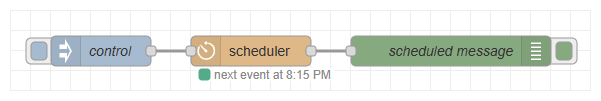
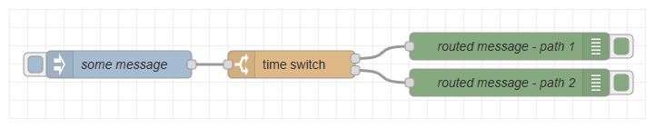

# node-red-contrib-chronos

A collection of Node-RED nodes for date and time based scheduling, queueing, routing, filtering and manipulating. Automatically calculated times from sun events (sunrise, sunset, dusk, dawn, ...) or moon events (moonrise, moonset) are supported as well.

If you encountered a bug, would like to propose a new feature or simply want to share your opinion about the software, please have a look at the [contribution guide](https://github.com/jensrossbach/node-red-contrib-chronos/blob/master/CONTRIBUTING.md) on the GitHub repository to learn more about how to contribute to this project. If you need help or have questions, please check out the [instructions for getting support](https://github.com/jensrossbach/node-red-contrib-chronos/blob/master/SUPPORT.md).

To see what has changed in recent versions of the software, please have a look at the project's [change log](https://github.com/jensrossbach/node-red-contrib-chronos/blob/master/CHANGELOG.md).

#### Scheduler
Schedules the transmission of messages or setting of global/flow variables at specific times.

#### Delay Until
Delays each message passing through the node until a specific time is reached.

#### Time Switch
Routes messages based on a specific time.

#### Time Filter
Filters messages based on a specific time.

#### Time Change
Modifies time values in messages or context stores.

## Documentation
The detailed documentation of each node is available in the wiki of the GitHub repository.

**&rarr; [Documentation](https://github.com/jensrossbach/node-red-contrib-chronos/wiki)**

## License
Copyright (c) 2021 Jens-Uwe Rossbach

This code is licensed under the MIT License.

Permission is hereby granted, free of charge, to any person obtaining a copy
of this software and associated documentation files (the "Software"), to deal
in the Software without restriction, including without limitation the rights
to use, copy, modify, merge, publish, distribute, sublicense, and/or sell
copies of the Software, and to permit persons to whom the Software is
furnished to do so, subject to the following conditions:

The above copyright notice and this permission notice shall be included in all
copies or substantial portions of the Software.

THE SOFTWARE IS PROVIDED "AS IS", WITHOUT WARRANTY OF ANY KIND, EXPRESS OR
IMPLIED, INCLUDING BUT NOT LIMITED TO THE WARRANTIES OF MERCHANTABILITY,
FITNESS FOR A PARTICULAR PURPOSE AND NONINFRINGEMENT. IN NO EVENT SHALL THE
AUTHORS OR COPYRIGHT HOLDERS BE LIABLE FOR ANY CLAIM, DAMAGES OR OTHER
LIABILITY, WHETHER IN AN ACTION OF CONTRACT, TORT OR OTHERWISE, ARISING FROM,
OUT OF OR IN CONNECTION WITH THE SOFTWARE OR THE USE OR OTHER DEALINGS IN THE
SOFTWARE.

## Attribution
The following icons have been taken from Node-RED provided nodes:
* Timer icon (Node-RED delay node)
* Switch icon (Node-RED switch node)
* Flip icon (Node-RED change node)

The following icons have been taken from Flaticon:
* Hour glass icon made by <a href="https://www.flaticon.com/authors/freepik" title="Freepik">Freepik</a> from <a href="https://www.flaticon.com/" title="Flaticon">www.flaticon.com</a>
* Funnel icon made by <a href="https://www.flaticon.com/free-icon/funnel_843709?term=filter&page=1&position=13" title="Kiranshastry">Kiranshastry</a> from <a href="https://www.flaticon.com/" title="Flaticon">www.flaticon.com</a>

For the calculation of sun and moon position based times, the nodes make use of the great Node.js library [SunCalc](https://www.npmjs.com/package/suncalc) from [Vladimir Agafonkin](https://www.npmjs.com/~mourner). Date and time algorithms are provided by the Node.js library [Moment.js](https://www.npmjs.com/package/moment).

The map for showing the location coordinates in the configuration node is provided by [OpenStreetMap](https://www.openstreetmap.org).